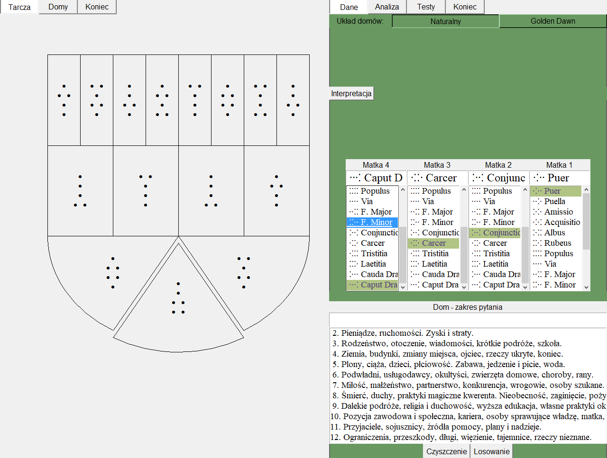

# Geomancy
Geomancy: Arabic method of divination 

## Table of contents
* [General info](#general-info)
* [Screenshot](#Screenshot)
* [Technologies](#technologies)

## General info
Program for geomancy: Arabic method of divination developed in Africa 
and Europe (nowadays connected with Western astrology, which is 
not a surprise in Golden Dawn circles)

## Screenshot

## Technologies
Project is created with:
* Python 3.7.0
* ... with tkinter

